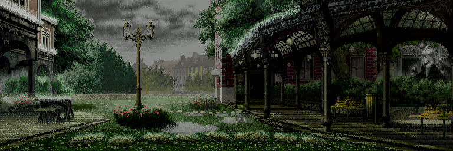
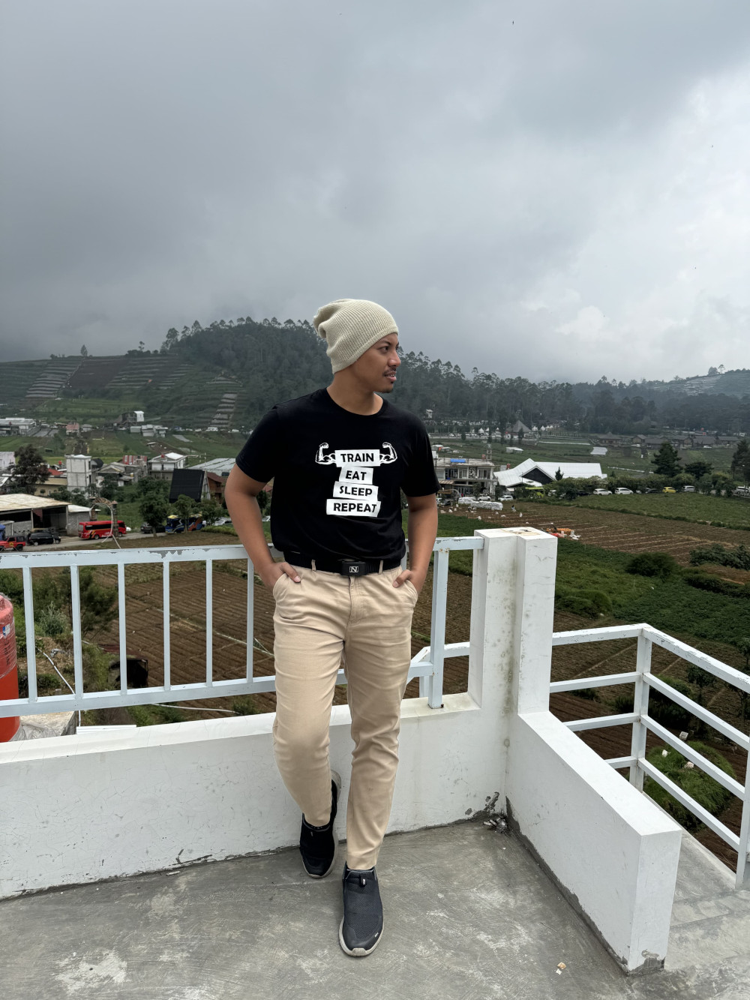

# Assigment Website Project

This website is an example website project built with HTML, CSS and Javascript.
I took a coffee shop simple website profile in this page.

## 📔 Link to my deployment and repository
* Deploy link: [module1-revou-kingahmadr.ahmadcloud.my.id](https://module1-revou-kingahmadr.ahmadcloud.my.id//) 
* Repository link: [github.com/revou-fsse-5/module-1-kingahmadr.git](https://github.com/revou-fsse-5/module-1-kingahmadr.git)
 
 
 
# 👨‍💻 About Me

<!-- 

    
    
👋 Hi there! I'm a passionate Cloud Engineer and Linux System Administrator on an exciting journey towards becoming a Software Engineer. My goal in diving into Software Engineering is to embrace the vast opportunities this dynamic field offers. I'm thrilled to see how this new adventure unfolds from where I am now. Looking forward to the challenges and growth ahead! 🚀

 
  -->

👋 Hi there! I'm a passionate Cloud Engineer and Linux System Administrator on an exciting journey towards becoming a Software Engineer. My goal in diving into Software Engineering is to embrace the vast opportunities this dynamic field offers. I'm thrilled to see how this new adventure unfolds from where I am now. Looking forward to the challenges and growth ahead! 🚀

> _"さらに向こうへ！プルス ウルトラ！！”_ - All Might from Boku no Hero
> 
> _"Further beyond! Plus Ultra!!”_ - All Might from Boku no Hero
> 
---

## 🌱 **Currently Learning**

---

## 📚 **Skills**

- **Favorite programming language**: `Python` `PHP` `Javascript` `HTML`
- **Hard skills**: `Cloud Computing` `Linux Administrator` `CI/CD` `Container Orchestration`
- **Soft skills**: 
  - `Team work`
  - `Problem Solving`
  - `Effective Communication`
#

### 🛠 **Software & Tools**

    
    
    
    
    
    
    
    

---

 
